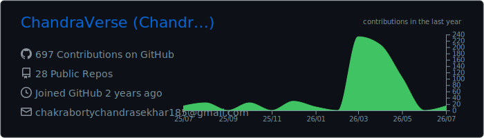
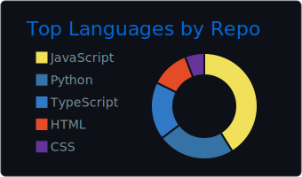
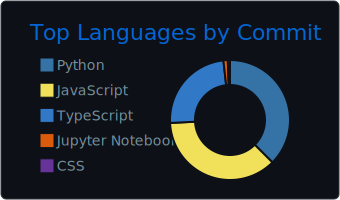
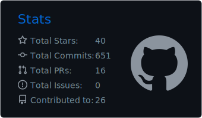
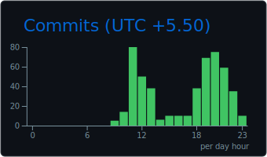

<h1 align="center">👋 Hey, I'm Chandra Sekhar Chakraborty</h1>
<h3 align="center">🛡️ Cybersecurity Analyst | SOC Analyst | Detection Engineering | Incident Response | Penetration Testing</h3>

<p align="center">
  
</p>

<p align="center">
  <a href="https://www.linkedin.com/in/chandra-sekhar-chakraborty-a9411a286/" target="_blank">
    
  </a>
  <a href="mailto:chakrabortychandrasekhar185@gmail.com">
    
  </a>
  <a href="https://github.com/ChandraVerse" target="_blank">
    
  </a>
</p>

---

## 🧠 About Me

<table>
<tr>
<td valign="top" width="60%">

I'm a **cybersecurity analyst** with hands-on experience in **SOC operations**, **SIEM monitoring**, **detection engineering**, and **incident response**. I build real detection pipelines, hunt threats using **MITRE ATT&CK**, and automate triage workflows with Python and SOAR tools.

I've completed **50+ SOC labs** on TryHackMe, authored **Sigma detection rules** mapped to adversary TTPs, and built automated **NIST 800-61** incident response platforms from scratch. I think like a **blue teamer by discipline** and a **red teamer by curiosity**.

```yaml
🎓 Degree   : B.Tech CSE (2026)
           Dr. Sudhir Chandra Sur Institute of Technology
📍 Location : Kolkata, West Bengal, India
🔭 Focus    : Detection Engineering | Threat Intel | IR
🎯 Mission  : Detect faster. Respond smarter. Defend stronger.
🌍 Target   : SOC Analyst L1 role in Europe / UK
```

**🔥 Currently:**
- 🏗️ Building [Enterprise Detection Engineering Lab](https://github.com/ChandraVerse/enterprise-detection-engineering-lab) — Elastic SIEM + Sigma + MITRE ATT&CK
- 🤖 Developing [Automated IR & Threat Intelligence Platform](https://github.com/ChandraVerse/automated-ir-threat-intelligence-platform) — Wazuh + SOAR + Grafana
- 📖 Deepening skills in **KQL**, **memory forensics**, **AD attack paths**
- 🏅 Pursuing **CompTIA Security+** and **Microsoft SC-200**

</td>
<td valign="top" width="40%" align="center">


<br/>

| 🛡️ SOC Labs | 🔍 Sigma Rules |
|:---:|:---:|
| **50+** | **10+ MITRE-mapped** |

</td>
</tr>
</table>

---

## 🛡️ Cybersecurity Skills

### 📊 SIEM & Detection
<p align="left">
  
  
  
  
  
  
  
  
</p>

### 🔍 Threat Intelligence
<p align="left">
  
  
  
  
  
  
</p>

### ⚙️ Scripting & Automation
<p align="left">
  
  
  
  
</p>

### 🔥 Incident Response
<p align="left">
  
  
  
  
  
</p>

### 🔴 Offensive Security
<p align="left">
  
  
  
  
  
  
  
  
</p>

### 🖥️ Platforms & Tools
<p align="left">
  
  
  
  
  
  
</p>

### 📋 Skills at a Glance

| Category | Tools & Technologies |
|---|---|
| SIEM & Detection | Splunk, Elastic SIEM, Wazuh, Sysmon, Sigma Rules, KQL, SPL, Atomic Red Team |
| Threat Intelligence | MITRE ATT&CK, VirusTotal, AbuseIPDB, Shodan, OSINT, IOC Analysis |
| Scripting & Automation | Python, Bash, PowerShell, REST API Integration, PDF Report Generation |
| Incident Response | NIST 800-61, Digital Forensics, Memory Analysis, Grafana, SOAR Automation |
| Offensive Security | Active Directory Attacks, Metasploit, Impacket, Nmap, BloodHound, Pass-the-Hash |
| Platforms & Tools | Linux, Windows Server, Git, CrackMapExec, Jira, ServiceNow |

---

## 💻 Tech Stack

<p align="left">
  
  
  
  
  
  
  
  
  
  
  
  
</p>

---

## 🚀 Featured Projects

### 🔵 [Enterprise Detection Engineering Lab](https://github.com/ChandraVerse/enterprise-detection-engineering-lab)
> Production-grade **Elastic SIEM** detection lab with Sysmon telemetry, 10+ **Sigma rules** mapped to **MITRE ATT&CK**, KQL/SPL conversions, and adversary simulation using **Atomic Red Team**.

`Python` `Elastic SIEM` `Sysmon` `Sigma Rules` `MITRE ATT&CK` `KQL` `SPL`

---

### 🤖 [Automated IR & Threat Intelligence Platform](https://github.com/ChandraVerse/automated-ir-threat-intelligence-platform)
> Python pipeline ingesting **Wazuh** alerts, enriching IOCs via **VirusTotal**, **AbuseIPDB** & **Shodan**, auto-generating **NIST 800-61** IR reports, SOAR triage automation, and a **Grafana** dashboard tracking MTTD and MTTR.

`Python` `Wazuh` `VirusTotal` `AbuseIPDB` `Shodan` `NIST 800-61` `SOAR` `Grafana`

---

### 📊 [SOC Analyst Log Analysis Lab](https://github.com/ChandraVerse/Log-Analysis-Lab)
> Simulated real-world SOC analyst investigations across multiple environment layers — covering Windows Event Logs, web server logs, and firewall traffic for threat detection and triage.

`Log Analysis` `Windows Event Logs` `Firewall Logs` `SOC` `Threat Detection`

---

### 🔍 [IP Investigation — VirusTotal Analysis](https://github.com/ChandraVerse/IP-Investigation)
> Hands-on threat intelligence task using **VirusTotal** to investigate suspicious IP addresses, analyze reputation scores, associated malware, and WHOIS data for SOC triage.

`Threat Intelligence` `VirusTotal` `IOC Analysis` `SOC Triage`

---

### 📶 [Monitoring Network Traffic — Wireshark Lab](https://github.com/ChandraVerse/Monitoring-Network-Traffic)
> Captured and analyzed real network traffic using **Wireshark** on a Linux VM — identifying anomalies, protocol patterns, and potential indicators of compromise in a SOC lab environment.

`Wireshark` `Network Forensics` `Linux` `Packet Analysis` `SOC`

---

### 🚨 [SOC L1 Alert Triage — TryHackMe Lab](https://github.com/ChandraVerse/SOC-L1-Alert-Triage)
> Completed a TryHackMe SOC Level 1 lab simulating real-world alert triage workflows — investigating, escalating, and documenting security incidents as an L1 analyst.

`TryHackMe` `Alert Triage` `SOC L1` `Incident Response` `Security Operations`

---

### 🏠 [Ghar_Nishchit — Rental Property Management App](https://github.com/ChandraVerse)
> Full-stack web application for managing rental properties, tenants, and payments. Built with **React**, **Tailwind CSS**, **Vite**, and **Node.js/MongoDB**.

`React` `Tailwind CSS` `Vite` `Node.js` `MongoDB`

---

## 📊 GitHub Statistics

<p align="center">
  
</p>
<p align="center">
  
  
  
</p>
<p align="center">
  
  
</p>

---

## 🎯 2026 Goals

- [ ] 🛡️ Earn **CompTIA Security+** certification
- [ ] 🔵 Complete **Microsoft SC-200** (Security Operations Analyst)
- [ ] 🧪 Build a full **SOC Home Lab** with SIEM + SOAR
- [ ] 🌍 Land a **SOC Analyst L1** role in Europe/UK
- [ ] 🔴 Complete **eJPT** (Junior Penetration Tester) certification
- [ ] 🚀 Deploy **Ghar_Nishchit** to production

---

## 🏅 Certifications

- 🟡 **Cisco Certified Junior Cybersecurity Analyst**
- 🟡 **Wireshark Packet Analysis** — Udemy
- 🟡 **Cisco Network Defense**
- 🟡 **Cisco Endpoint Security**
- 🟡 **TryHackMe SOC Level 1 Learning Path**

---

## 📫 Connect With Me

<p align="center">
  <a href="https://www.linkedin.com/in/chandra-sekhar-chakraborty-a9411a286/">
    
  </a>
  <a href="https://github.com/ChandraVerse">
    
  </a>
  <a href="mailto:chakrabortychandrasekhar185@gmail.com">
    
  </a>
</p>

<p align="center">
  
</p>

<p align="center">
  <i>"The art of war teaches us to rely not on the likelihood of the enemy's not coming, but on our own readiness to receive him." — Sun Tzu</i>
</p>
